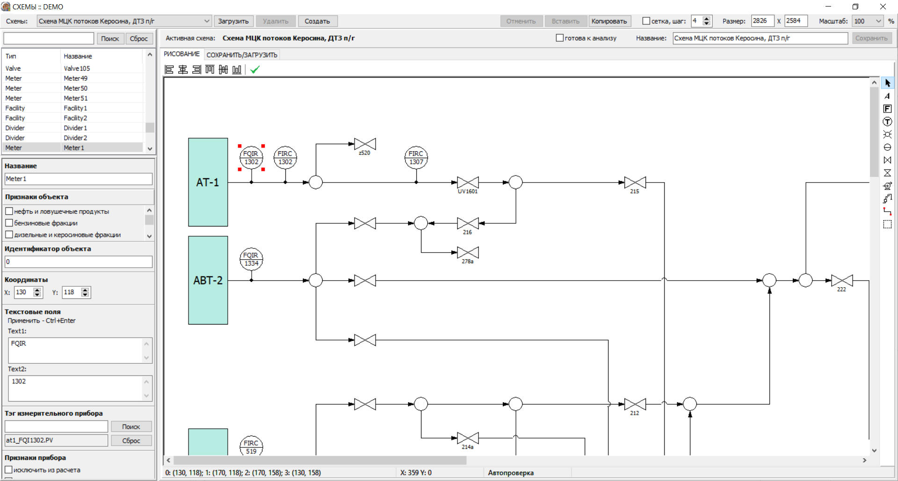

# pipelines_schemas_editor
The part of the large automated system "Analysis of data consistency of material flows of the enterprise" for oil refining industry.
This schema editor is one of modules of large industrial system which was fully developed by me in 2019-2020. 
Here I present standalone demo version of editor with build-in objects and schemas. 
Due to copyright of my former employer to all code I put here only one file with code and class diagram which can present my abilities in object oriented programming and also skills in user interface design.
VisualObjects.pas containing definitions and hierarchy of shemas graphical objects.
You can try to create or edit build-in schemas in designer.exe application.

